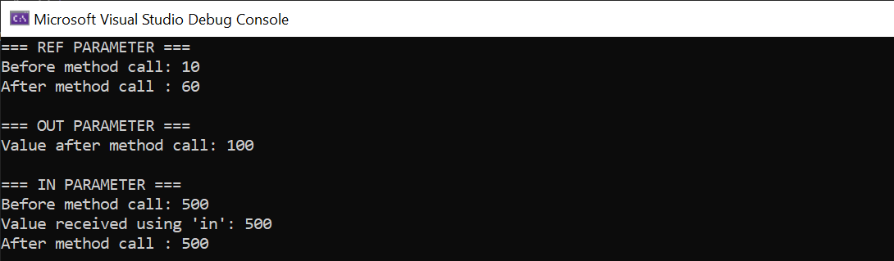

# 🚀 Exercise 08 - Use ref, out, and in Parameters

> 📚 **Module:** C# & ADO.NET  
> 🎯 **Exercise:** 08  
> 🏢 **Program:** Cognizant Upskilling

---

## 📖 Objective

The objective of this exercise is to understand and demonstrate the use of **ref**, **out**, and **in** parameter modifiers in C#. These modifiers control how arguments are passed to methods and determine whether values can be modified, initialized, or accessed as read-only.

---

## 🛠️ Tools & Technologies

| Technology | Details |
|------------|---------|
| 💻 IDE | Visual Studio Community 2022 |
| ⚙️ Framework | .NET 8.0 |
| 💙 Language | C# |
| 🖥️ Application Type | Console Application |

---

## 📂 Project Structure

```text
8. Use ref, out, and in Parameters
│
├── Exercise08_RefOutInParameters
│   ├── Program.cs
│   ├── Exercise08_RefOutInParameters.csproj
│   ├── Output.png
│   └── Properties
│
└── README.md
```

---

## 📋 Exercise Requirements

The program demonstrates:

- ✅ Creating a method using `ref`
- ✅ Creating a method using `out`
- ✅ Creating a method using `in`
- ✅ Printing values before method calls
- ✅ Printing values after method calls
- ✅ Understanding how each modifier affects variables

---

# 🧠 Concepts Covered

## 🔹 ref Parameter

The `ref` keyword passes a variable by reference.

### Characteristics

- Variable must be initialized before passing.
- Method can read the value.
- Method can modify the value.
- Changes affect the original variable.

### Example

```csharp
static void ModifyWithRef(ref int number)
{
    number += 50;
}
```

---

## 🔹 out Parameter

The `out` keyword passes a variable by reference and requires the method to assign a value before returning.

### Characteristics

- Variable does not need initialization.
- Method must assign a value.
- Commonly used to return multiple values.

### Example

```csharp
static void GenerateValue(out int number)
{
    number = 100;
}
```

---

## 🔹 in Parameter

The `in` keyword passes a variable by reference but makes it read-only inside the method.

### Characteristics

- Variable must be initialized.
- Method can read the value.
- Method cannot modify the value.

### Example

```csharp
static void DisplayValue(in int number)
{
    Console.WriteLine(number);
}
```

---

# 💻 Program Flow

### Step 1

Initialize a variable and pass it using `ref`.

```csharp
int refValue = 10;
ModifyWithRef(ref refValue);
```

### Step 2

Pass an uninitialized variable using `out`.

```csharp
int outValue;
GenerateValue(out outValue);
```

### Step 3

Pass a variable using `in`.

```csharp
int inValue = 500;
DisplayValue(in inValue);
```

---

## ▶️ Sample Output

```text
=== REF PARAMETER ===
Before method call: 10
After method call : 60

=== OUT PARAMETER ===
Value after method call: 100

=== IN PARAMETER ===
Before method call: 500
Value received using 'in': 500
After method call : 500
```

---

## 📷 Output Screenshot



---

# 📊 Comparison of Parameter Modifiers

| Feature | ref | out | in |
|----------|------|------|------|
| Passed by Reference | ✅ Yes | ✅ Yes | ✅ Yes |
| Must be Initialized Before Call | ✅ Yes | ❌ No | ✅ Yes |
| Can Read Existing Value | ✅ Yes | ❌ No | ✅ Yes |
| Can Modify Value | ✅ Yes | ✅ Yes | ❌ No |
| Must Assign Value in Method | ❌ No | ✅ Yes | ❌ No |

---

# 🌟 Advantages

### ref

- Enables modification of original data.
- Reduces memory usage for large objects.

### out

- Useful for returning multiple values.
- Commonly used in parsing methods.

### in

- Prevents accidental modifications.
- Improves performance for large read-only objects.

---

# 🎯 Learning Outcome

After completing this exercise, I understood:

- ✅ How `ref` passes variables by reference
- ✅ How `out` returns values through parameters
- ✅ How `in` creates read-only references
- ✅ Differences between parameter modifiers
- ✅ Real-world usage of parameter passing techniques

---

# 💡 Interview Insights

### ❓ What is the purpose of `ref`?

`ref` allows a method to modify the original variable by passing it by reference.

---

### ❓ What is the purpose of `out`?

`out` allows a method to assign and return values through parameters.

---

### ❓ What is the purpose of `in`?

`in` passes a variable by reference while preventing modifications inside the method.

---

### ❓ Can an `out` parameter be uninitialized before the method call?

✅ Yes.

```csharp
int number;
GenerateValue(out number);
```

---

### ❓ Can an `in` parameter be modified inside a method?

❌ No.

The compiler will generate an error if modification is attempted.

---

## 📌 Status

🟢 **Completed Successfully**

---

<div align="center">

### 🌟 Learning C# One Exercise at a Time 🚀

**Keep Learning • Keep Building • Keep Growing 💙**

</div>
