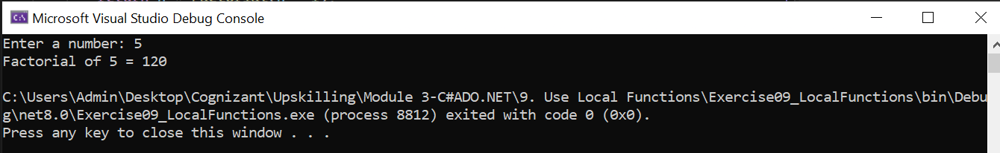

# 🚀 Exercise 09 - Use Local Functions

> 📚 **Module:** C# & ADO.NET  
> 🎯 **Exercise:** 09  
> 🏢 **Program:** Cognizant Upskilling

---

## 📖 Objective

The objective of this exercise is to learn how to define and use **Local Functions** in C#.

The program defines a `CalculateFactorial()` method that contains a local `Factorial()` function. The local function performs the factorial calculation, and the result is returned and displayed.

---

## 🛠️ Tools & Technologies

| Technology | Details |
|------------|---------|
| 💻 IDE | Visual Studio Community 2022 |
| ⚙️ Framework | .NET 8.0 |
| 💙 Language | C# |
| 🖥️ Application Type | Console Application |

---

## 📂 Project Structure

```text
9. Use Local Functions
│
├── Exercise09_LocalFunctions
│   ├── Program.cs
│   ├── Exercise09_LocalFunctions.csproj
│   ├── Output.png
│   └── Properties
│
└── README.md
```

---

## 📋 Exercise Requirements

The program demonstrates:

- ✅ Creating a method named `CalculateFactorial`
- ✅ Defining a local function inside `CalculateFactorial`
- ✅ Performing the factorial calculation using the local function
- ✅ Calling the local function from `CalculateFactorial()`
- ✅ Displaying the calculated factorial result

---

# 🧠 Concepts Covered

## 🔹 Local Functions

A **local function** is a function defined inside another method.

It can be accessed only within the scope of the containing method.

In this exercise:

```csharp
static int CalculateFactorial(int number)
{
    int Factorial(int n)
    {
        // Factorial calculation
    }

    return Factorial(number);
}
```

Here, `Factorial()` is the local function and `CalculateFactorial()` is the containing method.

---

## 🔹 Factorial

The factorial of a positive integer `n` is calculated as:

```text
n! = n × (n - 1) × (n - 2) × ... × 1
```

For example:

```text
5! = 5 × 4 × 3 × 2 × 1
   = 120
```

---

# 💻 Implementation

### CalculateFactorial Method

```csharp
static int CalculateFactorial(int number)
{
    int Factorial(int n)
    {
        if (n <= 1)
        {
            return 1;
        }

        return n * Factorial(n - 1);
    }

    return Factorial(number);
}
```

The `Factorial()` function is defined locally inside `CalculateFactorial()` and uses recursion to calculate the factorial.

---

## ▶️ Program Flow

```text
Main()
   ↓
CalculateFactorial(number)
   ↓
Local Function: Factorial()
   ↓
Calculate Factorial
   ↓
Return Result
   ↓
Display Result
```

---

## 🖥️ Sample Output

```text
Enter a number: 5
Factorial of 5 = 120
```

Another example:

```text
Enter a number: 7
Factorial of 7 = 5040
```

---

## 📷 Output Screenshot



---

# 🌟 Advantages of Local Functions

- ✅ Keeps helper logic close to where it is used
- ✅ Improves code organization
- ✅ Limits the scope of the helper function
- ✅ Helps avoid unnecessary class-level methods
- ✅ Makes related functionality easier to understand

---

# 🎯 Learning Outcome

After completing this exercise, I understood:

- ✅ What local functions are
- ✅ How to define a function inside another method
- ✅ How to call a local function
- ✅ How local functions limit the scope of helper logic
- ✅ How recursion can be used for factorial calculation

---

# 💡 Interview Insights

### ❓ What is a Local Function?

A local function is a function declared inside another method or member and can be accessed within its containing scope.

---

### ❓ Where is the `Factorial()` function defined?

The `Factorial()` function is defined inside the `CalculateFactorial()` method.

---

### ❓ Can the local function be called directly from `Main()`?

❌ No.

The `Factorial()` function is local to `CalculateFactorial()`, so it can only be called from within its containing scope.

---

### ❓ What is recursion?

Recursion is a technique where a function calls itself to solve a problem by breaking it into smaller instances.

In this exercise:

```csharp
return n * Factorial(n - 1);
```

the `Factorial()` function calls itself until the base condition is reached.

---

## 📌 Status

🟢 **Completed Successfully**

---

<div align="center">

### 🌟 Learning C# One Exercise at a Time 🚀

**Keep Learning • Keep Building • Keep Growing 💙**

</div>
